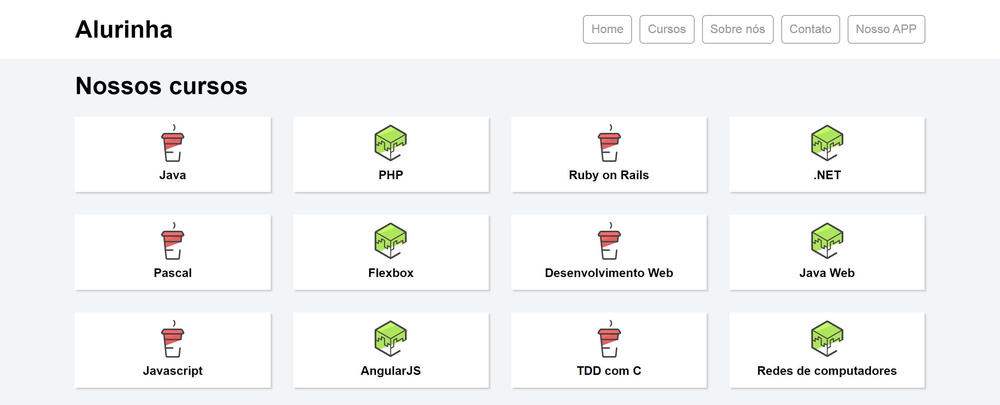

# Alurinha site

> Flex box estudos

Neste projeto foi criado o site da alurinha usando o flexbox para posicionar os elementos na tela. #cursoFlexBox :books:

[:paperclip: Clique aqui para ver o site hospedado](https://ericodesenvolvedor.github.io/flex-box-curso/)

## :computer: Tecnologias utilizadas

- Html
- Css
